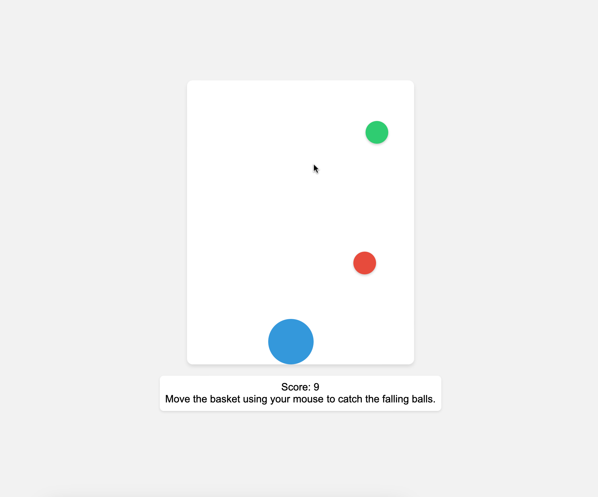

# Color Catcher Game

The Color Catcher Game is a simple browser-based game where you catch falling colored balls using a basket controlled by your mouse. The objective is to catch as many balls as possible to score points before they reach the bottom of the screen.

## Gameplay Instructions

1. Open the game in a web browser.
2. Move the basket horizontally using your mouse to catch the falling balls.
3. Each caught ball increases your score.
4. If a ball reaches the bottom without being caught, the game ends.
5. Aim to achieve the highest score possible!

## How to Run the Game

1. Clone or download the game's source code from the repository.
2. Open the `index.html` file in a web browser.
3. The game will start, and you can begin playing.

## Features

- Catch colorful balls with a basket controlled by your mouse.
- Score points for each caught ball.
- Dynamic score display on the page.
- Game over message and final score display.
- Responsive design, playable on desktop and mobile browsers.

## Preview

## Technologies Used

- HTML
- CSS
- JavaScript

## Contributing

Contributions are welcome! If you have any ideas, suggestions, or improvements, please feel free to create a pull request.

---

Enjoy playing the Color Catcher Game! Have fun catching those colorful balls and aim for a high score! If you have any questions or feedback, please don't hesitate to reach out.
